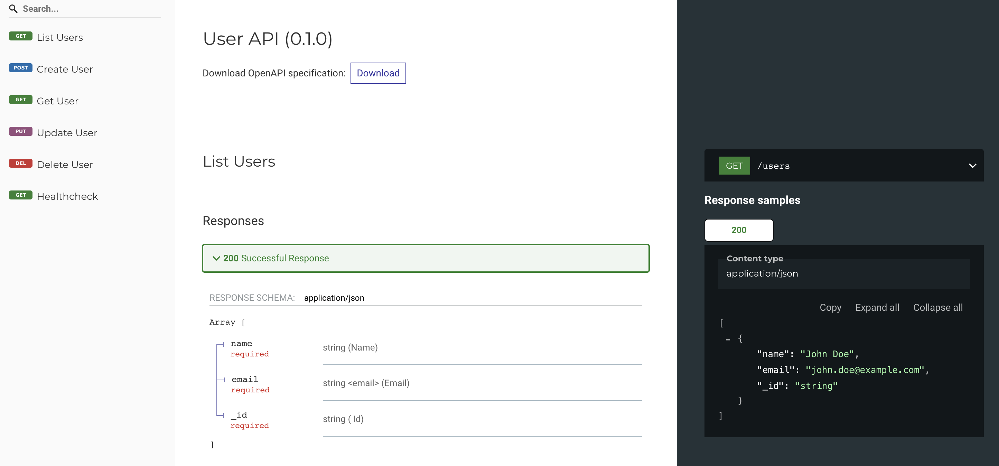

# FastAPI User CRUD Application

---

<p align="center">
  
</p>

---

This is a sample FastAPI application that connects to MongoDB and provides CRUD (Create, Read, Update, Delete) operations for user data. The application is designed with best practices in mind, incorporating:

- Connection Pooling with MongoDB
- Pydantic Models for data validation
- Object-Oriented Programming (OOP) principles
- Dataclasses
- Typing and AsyncIO usage
- Custom Logging with correlation IDs
- Middleware usage
- CORS Settings for security
- Unit Testing
- GitHub Actions Workflow for automated testing
- Docker Setup with multi-stage builds and non-root user
- Health Check Endpoint

## Table of Contents
- [Directory Structure](#directory-structure)
- [Features](#features)
- [Getting Started](#getting-started)
  - [Prerequisites](#prerequisites)
  - [Installation](#installation)
- [Running the Application](#running-the-application)
  - [With Docker Compose](#with-docker-compose)
  - [Without Docker](#without-docker)
- [API Documentation](#api-documentation)
- [Running Tests](#running-tests)
- [Docker Setup Details](#docker-setup-details)
- [Logging and Correlation IDs](#logging-and-correlation-ids)
- [Middleware](#middleware)
- [GitHub Actions CI/CD](#github-actions-cicd)
- [Contributing](#contributing)

## Directory Structure

```
├── app/
│   ├── main.py
│   ├── core/
│   │   ├── config.py
│   │   ├── security.py
│   ├── db/
│   │   └── connectors.py
│   ├── middleware/
│   │   └── correlation_id.py
│   ├── models/
│   │   └── users.py
│   ├── routers/
│   │   └── users.py
│   └── utils/
│       └── logger.py
├── tests/
│   └── test_user.py
├── .github/
│   └── workflows/
│       └── ci.yml
├── Dockerfile
├── docker-compose.yml
├── requirements.txt
├── .env (optional)
├── README.md
```

## Features

- Create User: Add a new user to the database
- Delete User: Remove an existing user
- List Users: Retrieve a list of all users
- Update User: Modify details of an existing user
- Health Check Endpoint: Verify the application's status

## Getting Started

### Prerequisites

- Python 3.12
- Docker and Docker Compose (if running with Docker)
- MongoDB (if running without Docker)
- Git (for cloning the repository)

### Installation

1. Clone the Repository

```bash
git clone https://github.com/yourusername/fastapi-user-crud.git
cd fastapi-user-crud
```

2. Set Up Environment Variables

Create a `.env` file in the root directory (optional, required if you need to override default settings):

```env
MONGODB_URI=mongodb://localhost:27017
MONGODB_DB=testdb
```

3. Install Dependencies (if running without Docker)

```bash
pip install -r requirements.txt
```

## Running the Application

### With Docker Compose

1. Build and Run the Containers

```bash
docker-compose up --build
```

2. Access the API
- API Base URL: http://localhost:8000
- Interactive API Docs: http://localhost:8000/docs
- Redoc: http://localhost:8000/redoc

### Without Docker

1. Ensure MongoDB is Running
- Install MongoDB and start the service.

2. Run the Application

```bash
uvicorn app.main:app --host 0.0.0.0 --port 8000 --reload
```

3. Access the API
- API Base URL: http://localhost:8000
- Interactive API Docs: http://localhost:8000/docs

## API Documentation

The application provides an OpenAPI specification accessible via Swagger UI.

- Swagger UI: http://localhost:8000/docs
- Redoc: http://localhost:8000/redoc

### Endpoints

#### Health Check
```
GET /healthcheck
Response: { "status": "ok" }
```

#### Create User
```
POST /users

Body:
{
  "name": "John Doe",
  "email": "john.doe@example.com",
  "password": "securepassword"
}

Response:
{
  "id": "user_id",
  "name": "John Doe",
  "email": "john.doe@example.com"
}
```

#### List Users
```
GET /users

Response:
[
  {
    "id": "user_id",
    "name": "John Doe",
    "email": "john.doe@example.com"
  },
  ...
]
```

#### Get User by ID
```
GET /users/{user_id}

Response:
{
  "id": "user_id",
  "name": "John Doe",
  "email": "john.doe@example.com"
}
```

#### Update User
```
PUT /users/{user_id}

Body:
{
  "name": "John Smith",
  "email": "john.smith@example.com"
}

Response:
{
  "id": "user_id",
  "name": "John Smith",
  "email": "john.smith@example.com"
}
```

#### Delete User
```
DELETE /users/{user_id}

Response:
{
  "status": "deleted"
}
```

## Running Tests

Unit tests are located in the `tests/` directory.

Run Tests:
```bash
python -m unittest discover -s tests
```

Tests will automatically run on each push or pull request via GitHub Actions.

## Docker Setup Details

The application uses a multi-stage Docker build for efficiency and security.

- Multi-stage Builds: Reduce the final image size by building dependencies separately
- Security Best Practices:
  - Runs the application as a non-root user (appuser)
  - Minimizes the number of layers and removes unnecessary packages
- Docker Compose: Orchestrates the application and MongoDB services

### Dockerfile

- Stage 1 (Builder): Installs dependencies and builds wheels
- Stage 2 (Final Image):
  - Copies the built wheels
  - Installs the application
  - Sets up a non-root user
  - Exposes port 8000

### Running Behind Nginx (Optional)

To run the application behind Nginx, you can modify the Docker Compose setup or add a new service in the `docker-compose.yml`.

## Logging and Correlation IDs

- Custom Logger: Configured to include correlation IDs in log messages
- Correlation IDs: Unique identifier for each request, useful for tracing and debugging

### Logger Configuration

Located in `app/utils/logger.py`:
- Format: `%(asctime)s - %(name)s - %(levelname)s - %(correlation_id)s - %(message)s`

### Middleware for Correlation IDs

Implemented in `app/middleware/correlation_id.py`:
- Adds a unique X-Request-ID header to each response
- Accessible throughout the application via context variables

## Middleware

- Correlation ID Middleware: Injects a unique ID into each request
- CORS Middleware: Configured to allow cross-origin requests (adjust settings for production)

### Adding Middleware

Middleware is added in `app/main.py`:

```python
app.add_middleware(CorrelationIdMiddleware)
```

## GitHub Actions CI/CD

Automated testing is set up using GitHub Actions.

### Workflow File

Located at `.github/workflows/ci.yml`.

Triggers:
- On push to the main branch
- On pull requests to the main branch

Jobs:
1. Set up Python environment
2. Install dependencies
3. Run unit tests

## Contributing

Contributions are welcome! Please follow these steps:

1. Fork the Repository

2. Create a Feature Branch
```bash
git checkout -b feature/your-feature-name
```

3. Commit Your Changes
```bash
git commit -m "Add your message here"
```

4. Push to Your Branch
```bash
git push origin feature/your-feature-name
```

5. Open a Pull Request
